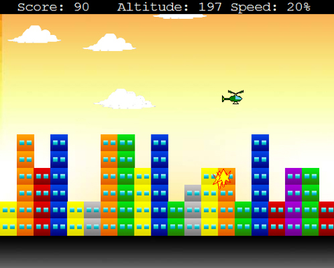

# Town Breakdown

The first major C++ project (Game Dev) I ever did back in 2012 as part of my academic curriculum.
A mini bomb-dropping helicopter-smashing game written with the `graphics.h` header file! :boom: :helicopter:

> Spare my school-level elementary programming skills with goto's and globals here and there :)

### Game Graphics

Built these a-pixel-at-a-time.

| Object         | Design                    |
| -------------- | ------------------------- |
| The Helicopter |  |
| The Bomb       |  |
| The Explosion  |  |

### Screenshots

##### 1. Landing Screen

##### 2. Main Menu

##### 3. How to Play

##### 4. Gameplay

##### 5. Oops!

### References

- Programming Simplified (www.programmingsimplified.com)
- Sumita Arora’s Computer Science for Class 12 (Book)
- CPlusPlus (www.cplusplus.com)
- WinBGIM website (www.cs.colorado.edu/~main/bgi)
- C Programming Reference (www.cprogrammingreference.com)
